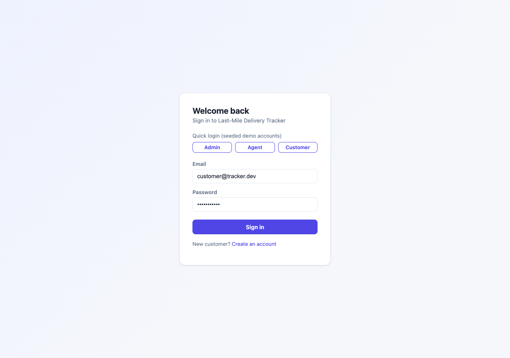
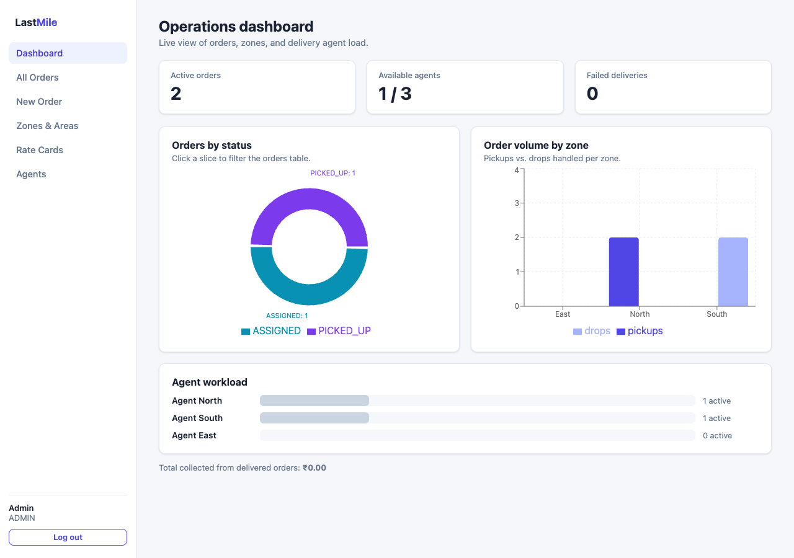
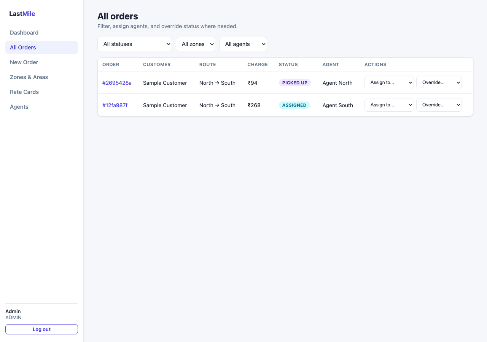
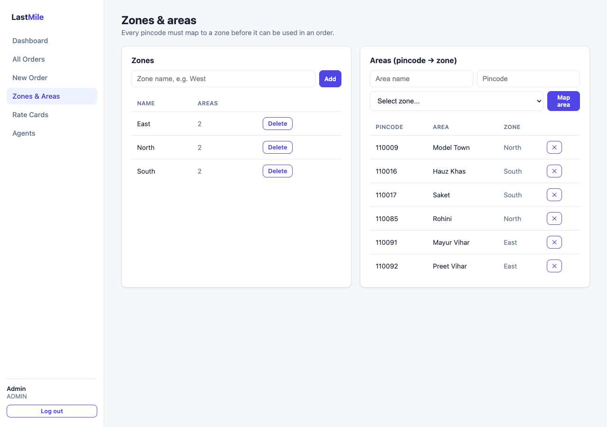
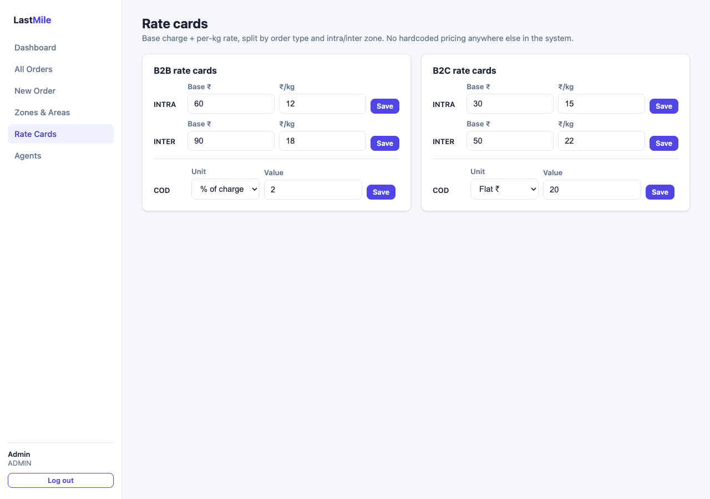
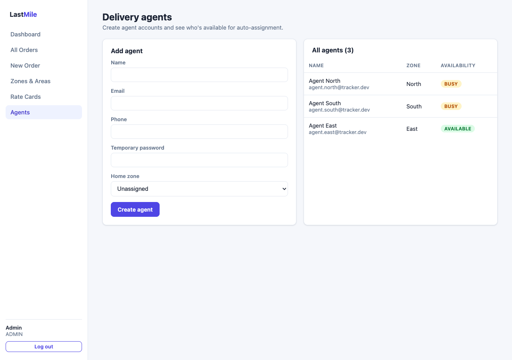
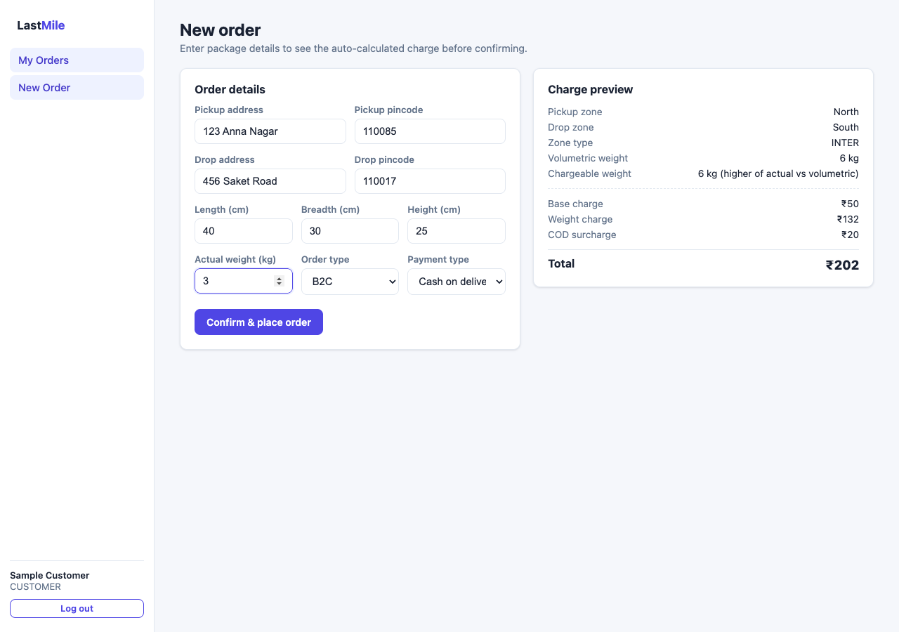
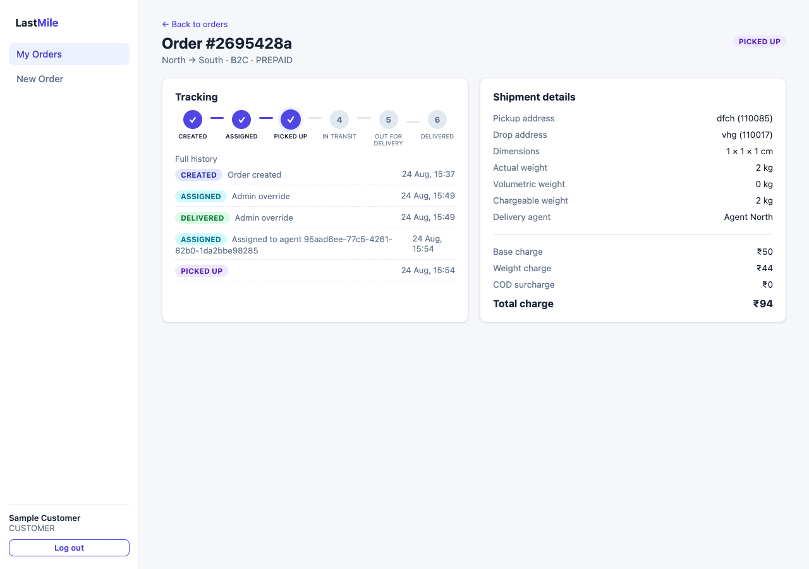
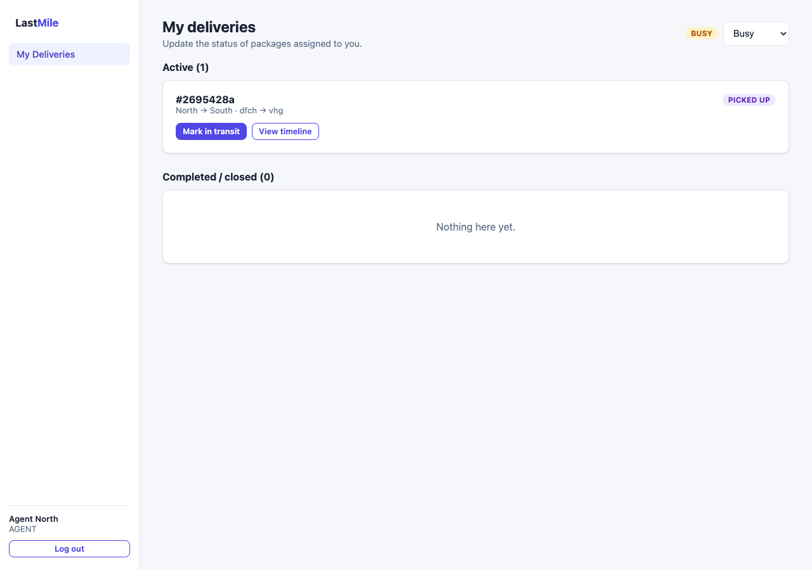
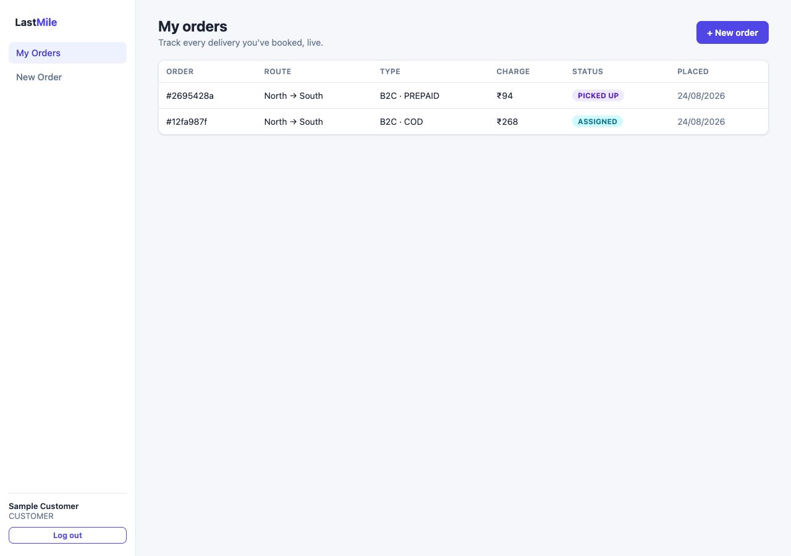

# Last-Mile Delivery Tracker

A delivery management platform where customers and admins create orders with
auto-calculated charges, agents are assigned intelligently, and customers are
notified at every step of the delivery journey — built to the "Last-Mile
Delivery Tracker" assignment brief.

**Stack:** Node.js + TypeScript + Express + Prisma + PostgreSQL (API) ·
React + TypeScript + Vite (frontend) · JWT auth with role-based access
(CUSTOMER / AGENT / ADMIN).

## Live demo

**[last-mile-delivery-tracker-five.vercel.app](https://last-mile-delivery-tracker-five.vercel.app)**

The login page has one-click "Admin / Agent / Customer" quick-login buttons
for the seeded demo accounts below — no need to type credentials. It's a
Hobby-plan serverless deployment, so the very first request after a period
of inactivity can take a couple of seconds to cold-start; that's expected.

| Role | Email | Password |
|---|---|---|
| Admin | `admin@tracker.dev` | `password123` |
| Customer | `customer@tracker.dev` | `password123` |
| Agent | `agent.north@tracker.dev` (also `.south`, `.east`) | `password123` |

## Screenshots

<table>
<tr>
<td width="50%">

**Login — one-click quick-login for each role**


</td>
<td width="50%">

**Admin dashboard — animated, interactive charts**


</td>
</tr>
<tr>
<td width="50%">

**All orders — filter by status/zone/agent, assign, override**


</td>
<td width="50%">

**Zones & areas — pincode → zone mapping**


</td>
</tr>
<tr>
<td width="50%">

**Rate cards — admin-configurable, intra/inter × B2B/B2C, COD surcharge**


</td>
<td width="50%">

**Agents — availability the auto-assignment engine reads**


</td>
</tr>
<tr>
<td width="50%">

**New order — live charge preview before confirming**


</td>
<td width="50%">

**Order tracking — animated stepper + immutable status history**


</td>
</tr>
<tr>
<td width="50%">

**Agent view — advance a delivery through its lifecycle**


</td>
<td width="50%">

**Customer's order list**


</td>
</tr>
</table>

## Contents

- [Screenshots](#screenshots)
- [Requirements checklist](#requirements-checklist)
- [Deliverables](#deliverables)
- [Quick start](#quick-start)
- [Environment variables](#environment-variables)
- [Project structure](#project-structure)
- [Database schema](#database-schema)
- [Rate calculation engine](#rate-calculation-engine)
- [Zone detection](#zone-detection)
- [Auto-assignment logic](#auto-assignment-logic)
- [Order status lifecycle](#order-status-lifecycle)
- [Notifications](#notifications)
- [API reference](#api-reference)
- [Deployment (Vercel)](#deployment-vercel)
- [Feature test walkthrough](#feature-test-walkthrough)

## Requirements checklist

Mapped directly against the assignment's Scope of Work and Technical
Expectations, so it's easy to verify nothing was skipped.

**Scope of Work**

| Requirement | Where |
|---|---|
| Input: pickup/drop address, L×B×H, actual weight, order type, payment type | [`NewOrderPage.tsx`](web/src/pages/NewOrderPage.tsx) form → [`orders.ts`](server/src/routes/orders.ts) `orderInputSchema` |
| Output: charge, agent assignment, status tracking, notifications | Same order object; see [Order status lifecycle](#order-status-lifecycle) |
| Admin manages zones, areas, rate cards (intra/inter × B2B/B2C), COD surcharge | [`AdminZonesPage.tsx`](web/src/pages/AdminZonesPage.tsx), [`AdminRateCardsPage.tsx`](web/src/pages/AdminRateCardsPage.tsx) |
| Customer register/login/order; admin can order on behalf of a customer | [`RegisterPage.tsx`](web/src/pages/RegisterPage.tsx); `NewOrderPage` shows a `customerEmail` field for admins |
| Zone detection, volumetric weight, higher-of billing, correct rate card, COD surcharge, **charge shown before confirm** | [Rate calculation engine](#rate-calculation-engine) — `POST /orders/quote` powers a live preview before the "Confirm & place order" button |
| Admin manual assign **or** auto-assign nearest agent | [All Orders](web/src/pages/AdminOrdersPage.tsx) has both an "Auto-assign" button and an "Assign to..." dropdown per order |
| Agent updates status through Picked Up / In Transit / Out for Delivery / Delivered / Failed | [`AgentDashboardPage.tsx`](web/src/pages/AgentDashboardPage.tsx), server-enforced via `AGENT_TRANSITIONS` |
| Failed → customer notified → reschedule → agent reassigned | [Order status lifecycle](#order-status-lifecycle) |
| Customer live status + full tracking timeline | [`OrderDetailPage.tsx`](web/src/pages/OrderDetailPage.tsx) + [`StatusStepper.tsx`](web/src/components/StatusStepper.tsx) |
| Email notifications on every status change | [Notifications](#notifications) (SMS included too, see below) |
| Admin views all orders, filters by **status / zone / agent**, overrides any status | `AdminOrdersPage` filter bar + "Override..." dropdown |

**Technical Expectations**

| Requirement | Where |
|---|---|
| Backend API, Frontend, Database, role-based auth | Express + Prisma + Postgres API, React SPA, JWT with `CUSTOMER`/`AGENT`/`ADMIN` roles ([`middleware/auth.ts`](server/src/middleware/auth.ts)) |
| Rate engine: zone detection, volumetric weight, B2B/B2C rate card lookup, COD surcharge, all admin-configurable, no hardcoding | [`rateEngine.ts`](server/src/services/rateEngine.ts) — every price comes from a `RateCard`/`CodSurcharge` row |
| Auto-assignment: nearest available agent by location or zone | [`assignmentService.ts`](server/src/services/assignmentService.ts) |
| Order status lifecycle with immutable tracking history (timestamp + actor per change) | `OrderStatusEvent` table — append-only, see [Database schema](#database-schema) |
| Failed delivery flow: flag, notify, reschedule, reassign | [Order status lifecycle](#order-status-lifecycle) |
| Email **and** SMS integration (any free tier) | Nodemailer (SMTP) + Twilio REST API, both in [`notificationService.ts`](server/src/services/notificationService.ts) / [`smsService.ts`](server/src/services/smsService.ts) |

## Deliverables

1. **Zip file with complete source code** — sent separately in this
   conversation (no `node_modules`/`.env`/`dist`; see [Quick start](#quick-start)
   to run it), and the same code is on GitHub at
   [github.com/CH4RUU/last-mile-delivery-tracker](https://github.com/CH4RUU/last-mile-delivery-tracker).
2. **README** with setup guide, `.env.example`, API docs, DB schema, and rate
   calculation logic — this file.
3. **Hosted application URL** —
   [last-mile-delivery-tracker-five.vercel.app](https://last-mile-delivery-tracker-five.vercel.app)
   (see [Live demo](#live-demo) above).
4. **System design write-up** (800 words max) —
   [`SYSTEM_DESIGN.md`](SYSTEM_DESIGN.md), covering the rate engine, zone
   detection, auto-assignment, and failed-delivery handling.

## Quick start

Prerequisites: Node.js 20+, Docker (for local Postgres) — or any Postgres
instance you already have.

```bash
# 1. Start Postgres locally
docker compose up -d postgres

# 2. Backend
cd server
cp .env.example .env          # defaults already point at the docker-compose db
npm install
npm run prisma:migrate         # creates tables
npm run seed                   # seeds zones/areas/rate cards/admin/agents/customer
npm run dev                    # http://localhost:4000

# 3. Frontend (in a second terminal)
cd web
npm install
npm run dev                    # http://localhost:5173 (proxies /api to :4000)
```

Open `http://localhost:5173` and use the quick-login buttons, or sign in with
any seeded account (password `password123` for all of them).

## Environment variables

See [`server/.env.example`](server/.env.example) for the full list. The only
required variable to run locally is `DATABASE_URL`; everything else
(`SMTP_*`, `TWILIO_*`, `DIRECT_URL`) is optional for local dev — when SMTP/
Twilio credentials are absent, notifications are still recorded in the
`Notification` table with status `SKIPPED` instead of being silently
dropped, so the notification pipeline is fully testable without any real
credentials.

## Project structure

```
server/               Express + TypeScript API
  prisma/schema.prisma   Data model (source of truth for the DB schema)
  prisma/seed.ts          Seed script
  src/routes/             REST endpoints, one file per resource
  src/services/           rateEngine, zoneService, assignmentService,
                           notificationService, smsService — all the business
                           logic lives here, routes stay thin
  src/middleware/          JWT auth guard, role guard, error handler
api/index.ts           Vercel serverless entry point (wraps the same Express
                        app — see Deployment)
web/                   React + Vite SPA
  src/pages/               One component per screen (customer/agent/admin)
  src/components/          StatusStepper (animated tracking timeline),
                           Layout (role-aware sidebar nav), badges
docker-compose.yml     Local Postgres for development
vercel.json            Vercel deploy config (static frontend + serverless API)
render.yaml            Alternative: one-click Render blueprint (persistent
                        Node process + Postgres, no serverless considerations)
```

## Database schema

Full definitions: [`server/prisma/schema.prisma`](server/prisma/schema.prisma).

- **User** — one table for all three roles (`role` enum: `CUSTOMER` /
  `AGENT` / `ADMIN`), since auth and profile fields are identical across
  roles and a role change never needs a row migration.
- **Zone** / **Area** — an `Area` is a pincode mapped to exactly one `Zone`.
  Every order's pickup/drop pincode is resolved to a zone through this table
  — nothing about zones is hardcoded in application code.
- **RateCard** — one row per `(orderType, zoneType)` pair (`B2B`/`B2C` ×
  `INTRA`/`INTER`), holding `baseCharge`, `perKgRate`, and
  `minChargeableWeight`. Admin-editable via the API/UI; the rate engine
  never hardcodes a price.
- **CodSurcharge** — one row per `orderType`, either a flat amount or a
  percentage of the (base + weight) charge.
- **AgentProfile** — 1:1 with a `User` (role `AGENT`). Tracks `currentZoneId`,
  optional `currentLat`/`currentLng`, and `availability`
  (`AVAILABLE`/`BUSY`/`OFFLINE`), which the assignment engine reads.
- **Order** — snapshots the full charge breakdown at creation time
  (`baseCharge`, `weightCharge`, `codSurcharge`, `totalCharge`,
  `volumetricWeightKg`, `chargeableWeightKg`) so historical orders stay
  correct even if rate cards change later.
- **OrderStatusEvent** — append-only tracking history: every status change
  inserts a row with `status`, `actorId`, `actorRole`, an optional `note`,
  and `createdAt`. Rows are never updated or deleted, which is what makes
  the tracking timeline immutable and auditable.
- **RescheduleRequest** — one row per reschedule attempt on a `FAILED`
  order, holding who requested it and the new date.
- **Notification** — one row per notification attempt (`EMAIL`/`SMS`),
  with status `SENT`/`FAILED`/`SKIPPED` and an `error` message when
  relevant — an audit log independent of whether the SMTP/Twilio
  credentials are configured.

## Rate calculation engine

Implemented in [`server/src/services/rateEngine.ts`](server/src/services/rateEngine.ts),
fully covered by the `/api/orders/quote` endpoint the frontend calls live as
the customer types.

1. **Volumetric weight** = `(L × B × H) / 5000` (cm, industry-standard
   divisor).
2. **Zone type**: `INTRA` if pickup zone === drop zone, else `INTER`
   (zones are resolved from pincodes first, via `zoneService`).
3. **Rate card lookup**: the active `RateCard` row for
   `(orderType, zoneType)` — 404s with a clear error if an admin hasn't
   configured one, rather than silently defaulting to some hardcoded price.
4. **Chargeable weight** = `max(actualWeight, volumetricWeight, minChargeableWeight)`
   — billed on the higher of actual vs. volumetric, per the spec.
5. **Charge** = `baseCharge + (chargeableWeight × perKgRate) + codSurcharge`,
   where `codSurcharge` is only added for `paymentType === COD` and is
   either a flat value or a percentage of `(base + weight)`, per the active
   `CodSurcharge` row for that `orderType`.

The engine is a pure function of its inputs and the current rate-card rows —
no order type, zone, or price is ever hardcoded in code. The exact same
function backs both the pre-confirmation quote and the order creation path,
so the price a customer sees is guaranteed to match what gets persisted.

## Zone detection

Zones are pincode-based rather than geocoded, to avoid depending on a paid
maps API: admins map `Area` (pincode) rows to a `Zone` in the UI
(`Zones & Areas` admin page), and every pickup/drop pincode on an order is
resolved through that table (`zoneService.resolveZoneForPincode`). An
unmapped pincode fails the quote with a clear message rather than guessing.

## Auto-assignment logic

Implemented in [`server/src/services/assignmentService.ts`](server/src/services/assignmentService.ts).
**Auto-assignment is the default** — it runs automatically right after an
order is created, so orders don't sit idle waiting for an admin to click
anything.

1. Only agents with `availability = AVAILABLE` are eligible.
2. If the order's pickup has lat/lng **and** at least one available agent has
   live coordinates, the nearest agent by haversine distance wins.
3. Otherwise, fall back to agents currently stationed (`currentZoneId`) in
   the order's pickup zone, oldest-updated first (a simple round-robin so
   load spreads across a zone's agents).
4. Otherwise, fall back to any available agent, oldest-updated first.
5. If no agent is available at all, the order is simply left unassigned —
   an admin can pick it up later from **All Orders** (either "Auto-assign"
   again, or hand-pick a specific agent from the "Assign to..." dropdown).

Assignment is transactional: the order is marked `ASSIGNED`, the agent is
flipped to `BUSY`, and an `OrderStatusEvent` is written, all in one
`prisma.$transaction`.

## Order status lifecycle

```
CREATED → ASSIGNED → PICKED_UP → IN_TRANSIT → OUT_FOR_DELIVERY → DELIVERED
                                                              ↘ FAILED → RESCHEDULED → ASSIGNED → ...
```

- **Agents** can only move an order forward one step at a time
  (`AGENT_TRANSITIONS` in `routes/orders.ts` enforces this server-side —
  the UI only ever offers the valid next step(s)).
- **Admins** can override an order to any status directly, for exception
  handling.
- Every transition — agent-driven or admin-overridden — appends an
  `OrderStatusEvent` row; the order's current `status` column is a
  denormalized "latest" pointer, but the event log is the source of truth
  and is never mutated.
- On `DELIVERED` / `FAILED` / `CANCELLED`, the assigned agent's
  `AgentProfile.availability` is automatically reset to `AVAILABLE`.
- On `FAILED`, the customer sees a "Reschedule" form on the order page.
  Submitting it creates a `RescheduleRequest`, moves the order to
  `RESCHEDULED`, clears the agent assignment, and immediately re-runs the
  auto-assignment pipeline for the next attempt — the same nearest-agent
  logic used for new orders.

## Notifications

`notificationService.notifyOrderStatus` fires on every status change and
fans out to email (Nodemailer, any SMTP provider) and SMS (Twilio's REST
API via a plain `fetch`, no SDK dependency) in parallel. Both channels
degrade gracefully: with no `SMTP_*`/`TWILIO_*` env vars set, sends are
skipped but still logged to the `Notification` table with status
`SKIPPED` and a reason — so the notification pipeline is visible and
testable (`GET` the order and check server logs) without needing any paid
service configured.

## API reference

All endpoints are under `/api`. Authenticated endpoints expect
`Authorization: Bearer <token>`.

| Method & path | Role | Purpose |
|---|---|---|
| `POST /auth/register` | public | Customer self-registration |
| `POST /auth/login` | public | Login, returns JWT |
| `GET /auth/me` | any | Current user |
| `GET /zones` | any | List zones + their areas |
| `POST /zones` · `PUT /zones/:id` · `DELETE /zones/:id` | admin | Manage zones |
| `GET /zones/areas` | any | List pincode → zone mappings |
| `POST /zones/areas` · `PUT .../:id` · `DELETE .../:id` | admin | Manage areas |
| `GET /rate-cards` | any | List rate cards |
| `POST /rate-cards` (upsert) · `PUT /rate-cards/:id` | admin | Configure rate cards |
| `GET /rate-cards/cod-surcharges` | any | List COD surcharges |
| `POST /rate-cards/cod-surcharges` · `PUT .../:id` | admin | Configure COD surcharge |
| `GET /agents` | admin | List agents + availability |
| `POST /agents` | admin | Create an agent account |
| `GET /agents/me` · `PATCH /agents/me` | agent | View/update own availability & location |
| `POST /orders/quote` | customer, admin | Charge preview, no persistence |
| `POST /orders` | customer, admin | Create order (admin passes `customerEmail`); auto-assigns an agent if one is available |
| `GET /orders` | any | List orders (auto-scoped: own orders for customer/agent, all for admin); filters `status`, `zoneId`, `agentProfileId` |
| `GET /orders/:id` | any (owner/assignee/admin) | Order detail + full tracking timeline |
| `POST /orders/:id/assign` | admin | `{ agentProfileId }` manual or `{ auto: true }` |
| `PATCH /orders/:id/status` | agent, admin | Advance (agent, restricted) or override (admin, any status) |
| `POST /orders/:id/reschedule` | customer, admin | `{ newDate }` on a `FAILED` order |

## Deployment (Vercel)

Vercel doesn't run a persistent Node server, so the deploy shape differs from
a typical Express app: [`vercel.json`](vercel.json) builds `web/` as a static
SPA and deploys the same Express app used locally as a single serverless
function at `api/index.ts` (Vercel only auto-detects functions in a
top-level `/api` directory, so the entry point can't live under `server/`).
It rewrites every `/api/*` request to that function while leaving the
original path intact, so Express's own router still handles `/api/orders`,
`/api/auth/login`, etc. unchanged. One project, one URL, no CORS setup
needed since frontend and API share an origin.

Postgres itself isn't hosted by Vercel — use [Neon](https://neon.tech)
(free, no card, has a native Vercel integration) or any other Postgres
you already have.

**1. Database.** In the Vercel dashboard, on the project you're about to
create: **Storage → Create Database → Neon** (or create a free Neon project
directly at neon.tech and copy its connection strings). Neon gives you two
connection strings:
- a **pooled** one (host has `-pooler` in it) → set as `DATABASE_URL`
- a **direct** one → set as `DIRECT_URL`

Append `?pgbouncer=true&connection_limit=1` to the pooled `DATABASE_URL` —
this is Prisma's documented setting for running through Neon's/PgBouncer's
transaction-pooled proxy from a serverless function (see
[Prisma's Neon guide](https://www.prisma.io/docs/orm/overview/databases/neon)),
and matters here because `assignmentService.assignAgentToOrder` and the
order status/reschedule routes use `prisma.$transaction`.

**2. Deploy.** In the Vercel dashboard: **Add New → Project**, import
`last-mile-delivery-tracker` from GitHub, leave **Root Directory** as the
repo root (do *not* point it at `web/` or `server/` — `vercel.json` expects
to sit at the root). Before the first deploy, set these **Environment
Variables** (Project Settings → Environment Variables):

| Key | Value |
|---|---|
| `DATABASE_URL` | Neon pooled connection string + `?pgbouncer=true&connection_limit=1` |
| `DIRECT_URL` | Neon direct connection string |
| `JWT_SECRET` | any long random string |
| `WEB_ORIGIN` | `*` (frontend and API share an origin, so this is mostly unused) |
| `SMTP_*` / `TWILIO_*` | optional, see [Notifications](#notifications) |

Deploy. The build (`vercel.json`'s `buildCommand`) builds the frontend,
installs the API's dependencies, runs `prisma generate`, `prisma migrate
deploy` (against `DIRECT_URL`), and the seed script — so the same seeded
accounts from local dev work immediately on the hosted URL.

Note: use the **Production** deployment URL (the stable
`<project>.vercel.app` alias) for sharing — per-commit preview URLs are
gated behind Vercel's own login by default and won't be reachable by anyone
without access to that Vercel account.

### Alternative: Render

[`render.yaml`](render.yaml) is also included as a Blueprint for Render,
which — unlike Vercel — runs a normal persistent Node process, so it needs
no serverless/pooled-connection considerations at all: one free Postgres
database, and one free web service that builds both `server/` and `web/`,
copies the built frontend into `server/web-dist` (served as static files by
Express), runs migrations + seed, and starts the API. In the Render
dashboard: **New → Blueprint**, connect the repo, deploy. `JWT_SECRET` is
auto-generated; `DATABASE_URL`/`DIRECT_URL` aren't needed since Render's
Postgres isn't pooled the way Neon's is.

## Feature test walkthrough

A fast way to exercise every requirement in one pass (works against the
[live demo](#live-demo) or local dev):

1. Quick-login as **Admin** → **Zones & Areas**: confirm the seeded
   zones/pincodes, add a new one if you like.
2. **Rate Cards**: tweak a base charge or COD surcharge, save.
3. Quick-login as **Customer** → **New Order**: fill in two different
   pincodes and watch the live charge preview update (zone detection +
   volumetric weight + your rate-card edit all reflected instantly). Place
   the order — it's automatically assigned to the nearest available agent,
   no admin step needed.
4. Back as **Admin** → **Dashboard**: see the new order in the status chart,
   click the slice (or the "Active orders" stat card) to jump to a filtered
   **All Orders** view. If you ever need to reassign, the "Assign to..."
   dropdown / "Auto-assign" button are there for manual override.
5. Quick-login as the assigned **Agent** → **My Deliveries**: step the order
   through Picked up → In transit → Out for delivery → Failed.
6. Log back in as the **Customer** → open the order → **Reschedule** with a
   new date. Watch it flip to `RESCHEDULED` and immediately get reassigned
   to an agent again, all visible in the tracking timeline.
7. Check the server logs (or the `Notification` table) — a notification was
   logged for every status change above.
